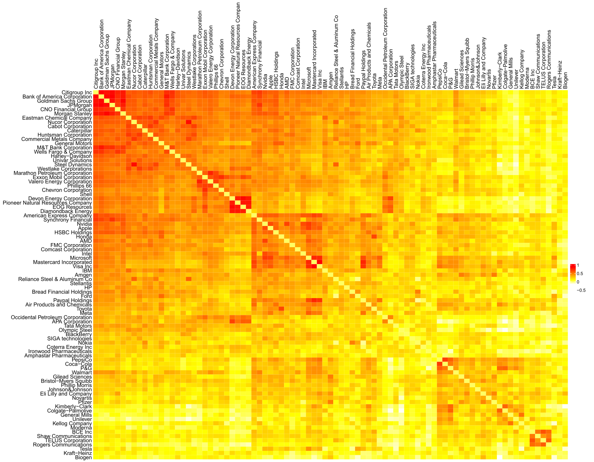
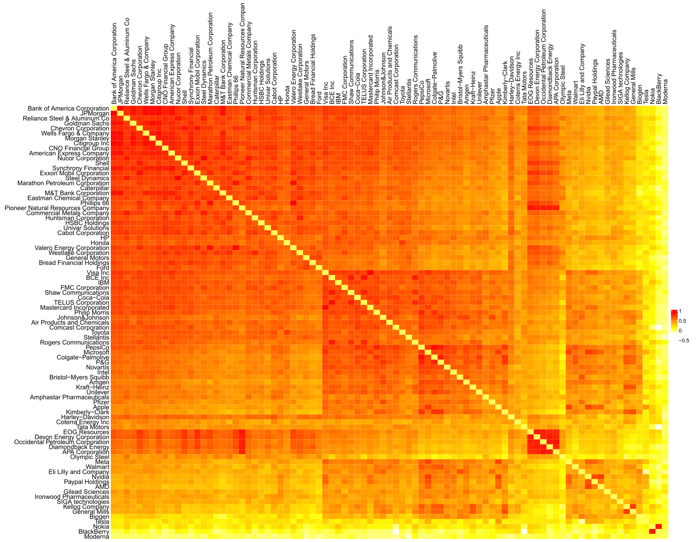
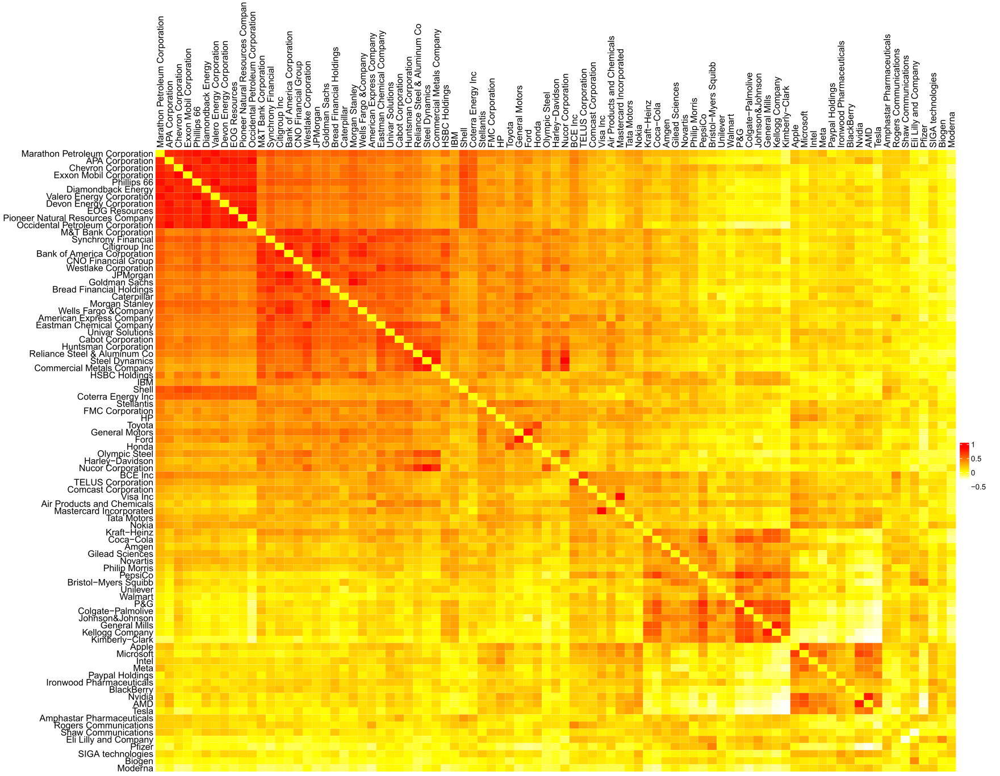
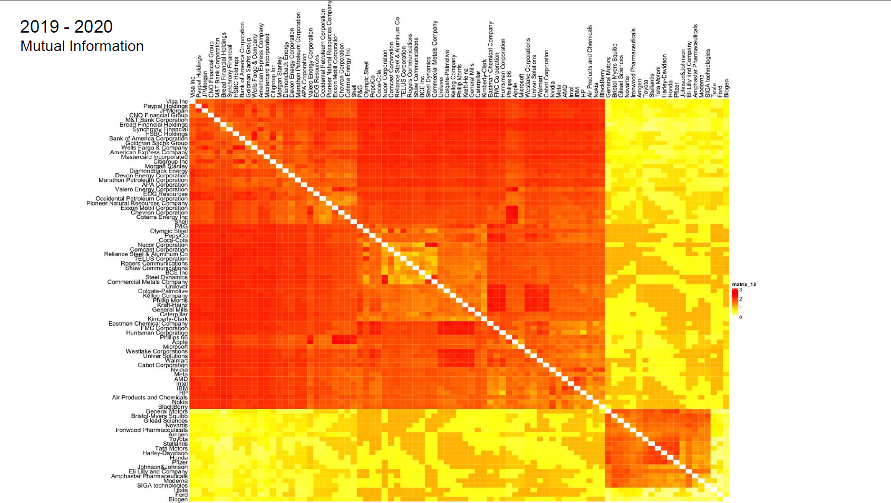
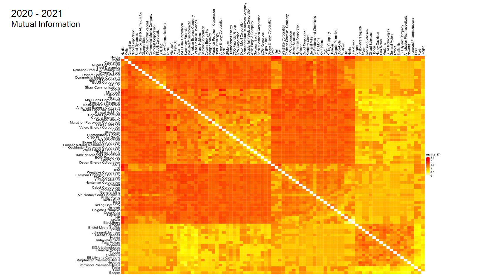
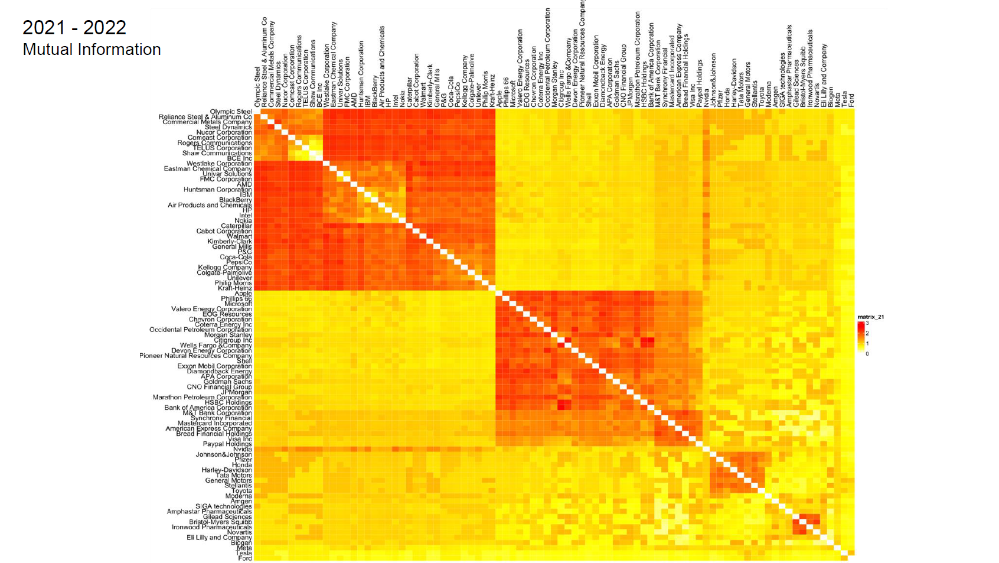

# NYSE Financial Network Analysis (2019–2022)

## Overview

This project studies the network structure of 87 large-cap stocks listed on the New York Stock Exchange (NYSE), using daily closing prices from 01/03/2019 to 28/02/2022.

The companies belong to 9 sectors:
- Automotive
- Pharmaceuticals
- Financial Services
- Energy
- Technology
- Chemicals
- Retail & Food
- Construction
- Telecommunications

The full period is divided into three subperiods:
1. 01/03/2019 – 29/02/2020  
2. 01/03/2020 – 28/02/2021 (COVID-19 crisis period)  
3. 01/03/2021 – 28/02/2022  

Price series were transformed into stationary return series (first differences).

## Network Construction

Two types of weighted networks were constructed, where each node represents a stock:

- **Pearson Correlation Network**
- **Mutual Information Network**

Edge weights correspond to:
- Pearson correlation coefficient
- Mutual Information values

Heatmaps were generated from the weighted adjacency matrices for each method and each subperiod.

## Heatmap Observations

### Pearson Correlation

- Correlations increase significantly during the COVID-19 crisis period.
- In the third period, energy and hydrocarbon-related companies exhibit stronger internal correlations.
- Stronger intra-sector clustering is observed.

### Pearson Correlation Heatmaps

Heatmap for Pearson correlation in Period 1 (01/03/2019 – 29/02/2020)

  

Heatmap for Pearson correlation in Period 2 (01/03/2020 – 28/02/2021, COVID-19 crisis)

  

Heatmap for Pearson correlation in Period 3 (01/03/2021 – 28/02/2022)

  

### Mutual Information

- Greater variation in correlation intensity.
- Stronger connections between pharmaceutical and automotive companies.
- During the crisis period, almost all sectors become more interconnected.
- Produces denser networks compared to Pearson.

### Mutual Information Heatmaps

Heatmap for Mutual Information in Period 1 (01/03/2019 – 29/02/2020)

  

Heatmap for Mutual Information in Period 2 (01/03/2020 – 28/02/2021, COVID-19 crisis)

  

Heatmap for Mutual Information in Period 3 (01/03/2021 – 28/02/2022)

  

## Key Findings

- Pearson networks emphasize linear and intra-sector relationships.
- Mutual Information captures both linear and non-linear dependencies.
- Mutual Information reveals cross-sector relationships not easily detected by Pearson correlation.
- During crisis periods, market-wide synchronization increases under both methods.

## Tools Used

- Time series preprocessing (stationarity transformation)
- Pearson correlation
- Mutual Information
- Weighted adjacency matrices
- Heatmap visualization

## Author
Tsoumaris Dimitrios
